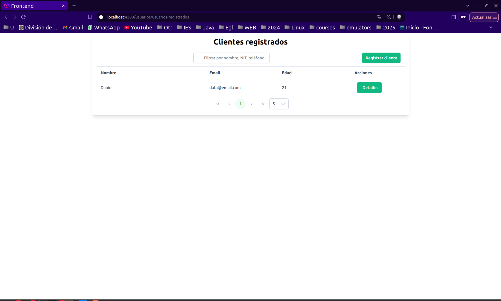
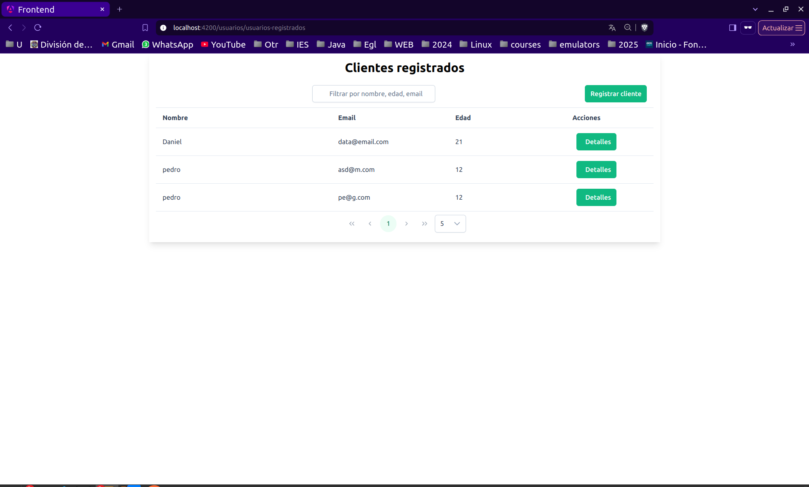
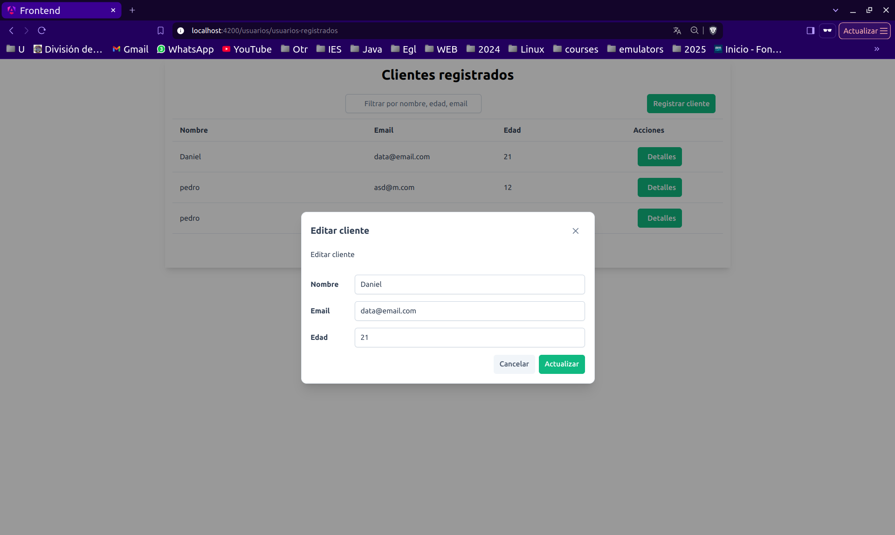
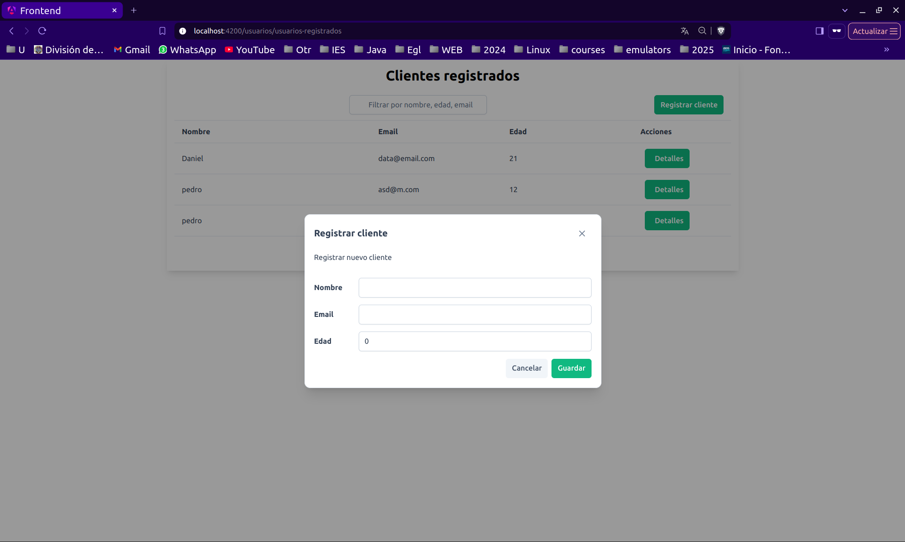
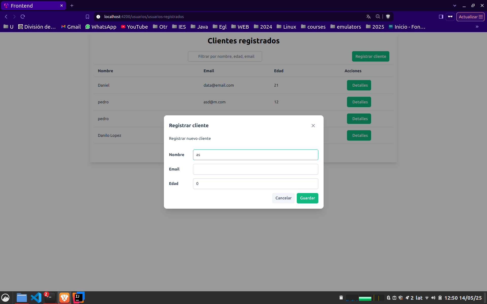
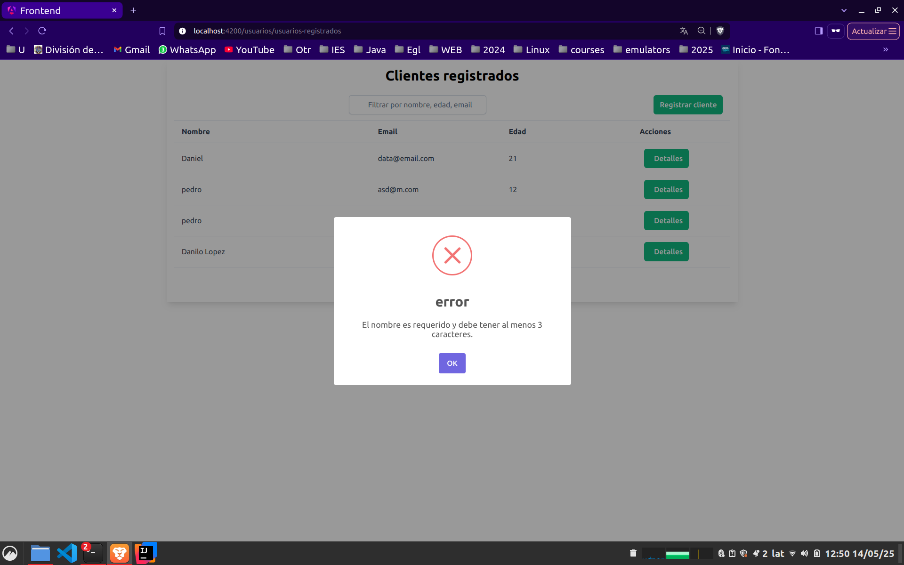
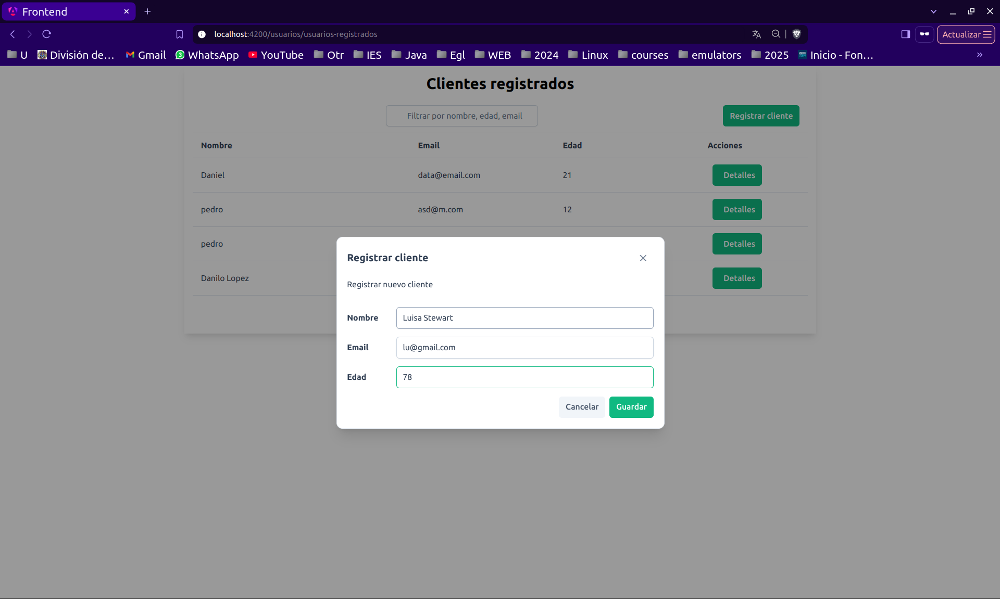
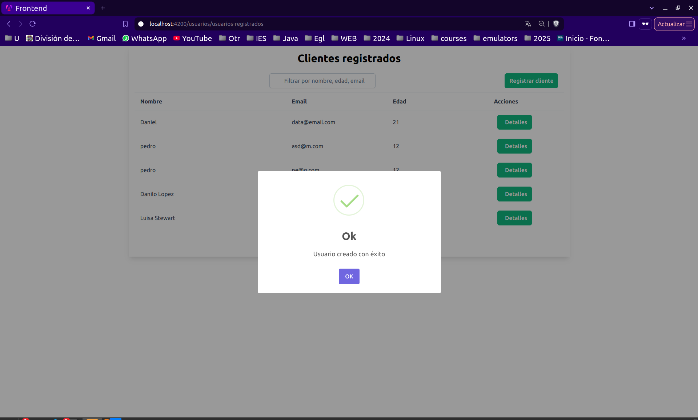

# prueba-tecnica

# Frontend Angular - Gestión de Usuarios

Este proyecto es un **frontend desarrollado con Angular**. Forma parte de una aplicación para la gestión de usuarios.

## Requisitos previos

- Node.js y npm instalados
- Angular CLI (si no lo tienes, instálalo con: `npm install -g @angular/cli`)

## Ejecución del proyecto

Para ejecutar la aplicación en modo de desarrollo, usa el siguiente comando, dentro de la carpeta raiz:

```bash
npm install
```

```bash
npm run start
```



















