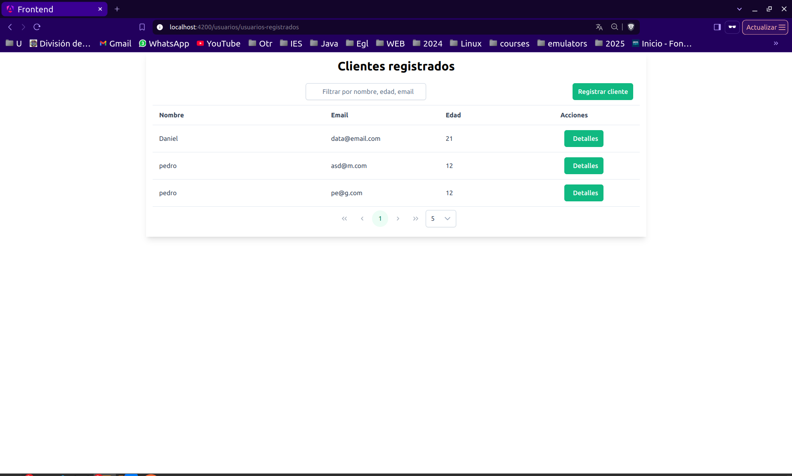
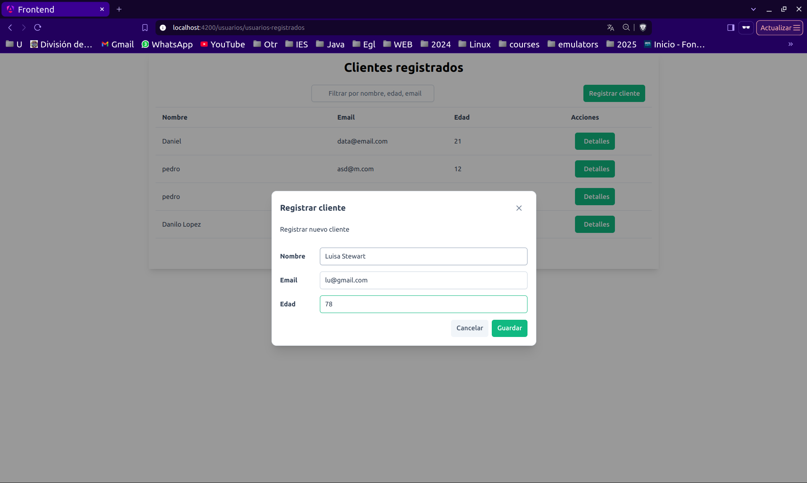

# prueba-tecnica

# Frontend Angular - Gestión de Usuarios

Este proyecto es un **frontend desarrollado con Angular**. Forma parte de una aplicación para la gestión de usuarios. Se ha implementado una interfaz moderna y responsiva utilizando Tailwind CSS para la estilización y PrimeNG (ngprime) para componentes UI avanzados. El objetivo principal de este módulo es ofrecer una experiencia de usuario fluida y eficiente en la administración de usuarios.

## Requisitos previos

- Node.js y npm instalados
- Angular CLI (si no lo tienes, instálalo con: `npm install -g @angular/cli`)

## Ejecución del proyecto

Para ejecutar la aplicación en modo de desarrollo, usa el siguiente comando, dentro de la carpeta raiz:

```bash
npm install
```

```bash
npm run start
```

Para acceder a la vista de usuarios, se debe ingresar a la ruta

```bash
http://localhost:4200/usuarios/usuarios-registrados
```








